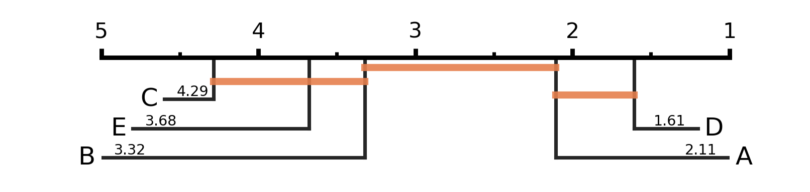
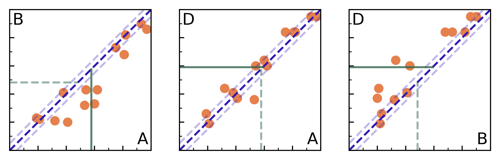
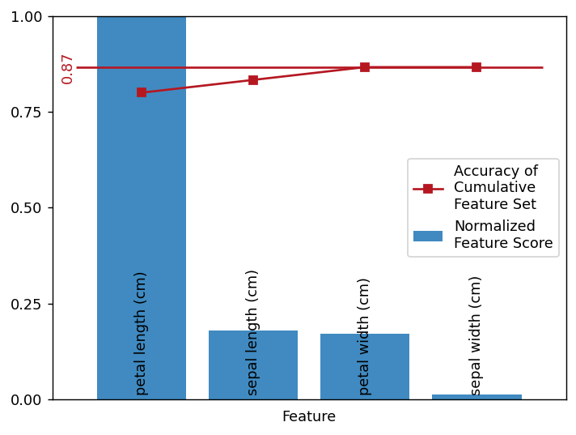

# CLASSIC
Classifier Comparison and Evaluation Tools

A python package for the analysis of classification performance.

## Applications

### Critical Difference Diagram

A main application is the comparison of categorized paired metric data, e.g. accuracy results of
different classification methods in machine learning.
Therefore __Classic__ implements the *critical difference diagram* (described in [[1]](#1)).

<a id="2"><u>Example</u></a>

Imagine that we have five different classification methods tested on 14 different datasets.
Every classifiers returns an accuracy result on each test set in the corresponding dataset.
We collect the results in a table like this:

Classifier |      |      |      |      |      |      |      |      |      |      |      |      |      |      |
-----------|------|------|------|------|------|------|------|------|------|------|------|------|------|------|
A          | 0.60 | 0.81 | 0.62 | 0.19 | 0.93 | 0.54 | 0.53 | 0.41 | 0.21 | 0.97 | 0.32 | 0.82 | 0.38 | 0.75 |
B          | 0.33 | 0.68 | 0.43 | 0.23 | 0.90 | 0.43 | 0.32 | 0.20 | 0.22 | 0.86 | 0.21 | 0.82 | 0.41 | 0.73 |
C          | 0.25 | 0.64 | 0.40 | 0.10 | 0.85 | 0.39 | 0.31 | 0.19 | 0.18 | 0.90 | 0.23 | 0.78 | 0.43 | 0.71 |
D          | 0.64 | 0.84 | 0.60 | 0.26 | 0.95 | 0.60 | 0.36 | 0.37 | 0.19 | 0.95 | 0.44 | 0.84 | 0.41 | 0.84 |
E          | 0.37 | 0.68 | 0.47 | 0.18 | 0.88 | 0.37 | 0.27 | 0.25 | 0.24 | 0.79 | 0.25 | 0.83 | 0.36 | 0.64 |

We load this table in a `numpy array` of shape `(5, 14)` and call the function
`classic.critical_difference_diagram`. The resulting plot can be seen below.

Markings on this number line represent the average ranks of one classifier based on his accuracy
over all datasets. The lowest rank corresponds to the highest accuracy. Classifiers are connected
by a horizontal line if they do not have a significant difference. This significance is based on
post-hoc Wilcoxon signed rank tests for each pair of classifiers.

Therefore, it seems like classifier D is the best choice for the overall classification task.
It works best on the 14 chosen datasets, altough it's not the best classfier for every single
dataset on its own. But we can also see, that there is no significant (`alpha=0.05`) difference in
the accuracy results of classifier D and A. If D would be much more computationally expensive than
A, then we should consider choosing A as the better classifier.

### Scatter Matrix

For an in-depth comparison of the classifiers on single datasets a special type of scatter matrix
that is designed to compare multiple categories of data can be found in __Classic__.

<u>Example</u>

For a more elaborate decision in the [example above](#2) we could directly compare the best three
classifiers A, B and D using the function `classic.scatter_comparison.`

Points above the diagonal line represent datasets that are better classified by the method in the
upper left corner. A horizontal and vertical line indicates the mean accuracy of the corresponding
classifier. A solid line marks the higher mean.
A choice can now be easily made for the comparison of classifier A and B as well as B and D.
We also see that D is better than A in mean accuracy but that A has a big advantage on one dataset
that is well beyond the diagonal line for five percent difference.
The datasets could now be further analyzed by, for example, looking at the number of training and
test instances. An option for setting the opacity value of points in the scatterplots accordingly
is available.

### Feature Score

Evaluating the importance of features in data can be very helpful in reducing the dimensionality of
the feature space. While principal component analysis transforms original features into new ones,
it can also be used to creating a ranking of those features. __Classic__ is able to compute the
feature score for a given dataset.

<u>Example</u>

We can analyze the importance of the four features in the well-known IRIS dataset by using the
method `classic.plot_feature_score`.

  </align>

The plot shows the normalized feature score. The 'most important' feature based on that score is
'petal length (cm)'. All other features then have a relatively low score, e.g. sepal length's score
is about 80% lower. The red markings show the accuracy results of a ridge classifier where only the
first `n` features (in descending score order) are used (`n` gets incremented with each step on the
x-axis).

## References

<a id="1">[1]</a>
Demšar, Janez (2006).
"Statistical comparisons of classifiers over multiple data sets."
The Journal of Machine learning research 7, 1-30.
